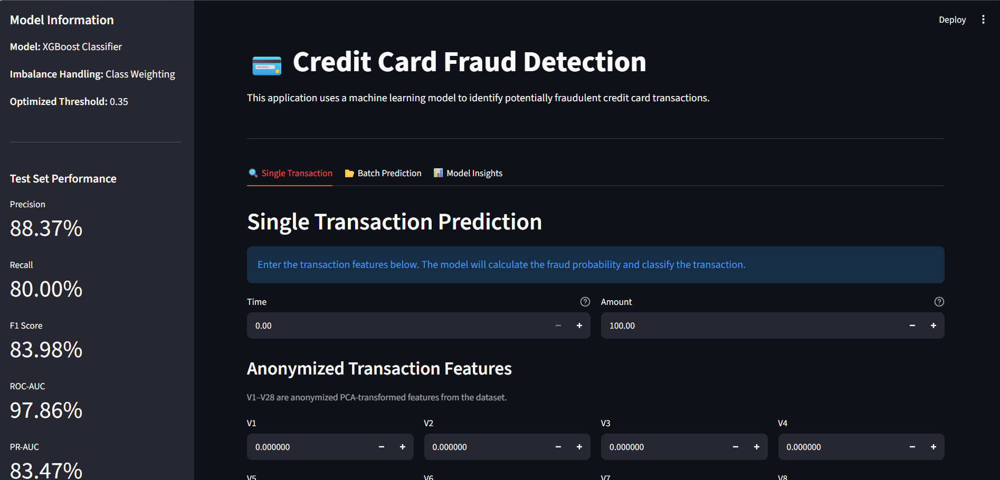
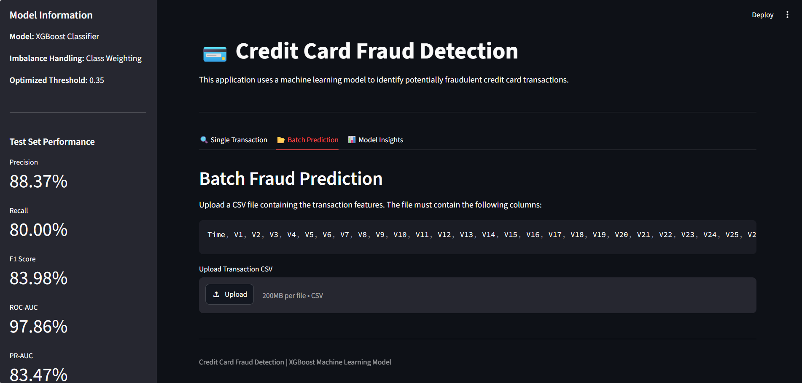
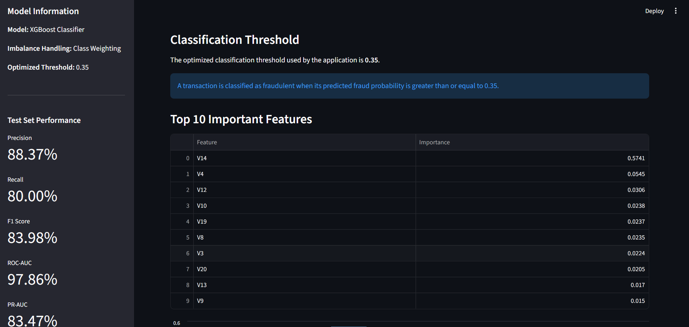

# Credit_Card_Fraud_Detection_using_Machine_Learning

## Project Overview

Credit card fraud detection is a highly imbalanced binary classification problem where the number of legitimate transactions is significantly higher than fraudulent transactions.

This project develops an end-to-end Machine Learning solution for detecting fraudulent credit card transactions using the Credit Card Fraud Detection dataset from Kaggle.

The project covers the complete machine learning workflow, including:

* Data loading and understanding
* Data cleaning
* Duplicate removal
* Exploratory Data Analysis (EDA)
* Class imbalance analysis
* Feature distribution analysis
* Correlation analysis
* Outlier analysis
* Train-test split
* Feature scaling
* Baseline model comparison
* Class imbalance handling
* XGBoost model development
* Hyperparameter tuning
* Classification threshold optimization
* Final model evaluation
* Feature importance analysis
* Model serialization
* Streamlit deployment
* Single transaction prediction
* Batch transaction prediction

## Objectives

The main objectives of this project are:

* Analyze the credit card transaction dataset.
* Understand the characteristics of legitimate and fraudulent transactions.
* Identify and remove duplicate records.
* Perform exploratory data analysis to identify important patterns.
* Analyze the severe class imbalance in the target variable.
* Prepare the data for machine learning.
* Compare multiple classification algorithms.
* Handle class imbalance using appropriate techniques.
* Build and optimize an XGBoost classification model.
* Optimize the classification threshold using validation data.
* Evaluate the final model using fraud-focused performance metrics.
* Identify important features contributing to model predictions.
* Save the trained model and supporting artifacts.
* Develop a Streamlit application for real-time and batch fraud prediction.

## Dataset

The project uses the Credit Card Fraud Detection dataset from Kaggle.

The dataset contains transactions made by European cardholders over a period of two days.

### Dataset Characteristics

| Property                   |   Value |
| -------------------------- | ------: |
| Original Rows              | 284,807 |
| Original Columns           |      31 |
| Rows Removed as Duplicates |   1,081 |
| Final Rows                 | 283,726 |
| Features                   |      30 |
| Target Variable            | `Class` |
| Legitimate Transactions    | 283,253 |
| Fraudulent Transactions    |     473 |
| Legitimate Transactions    |  99.83% |
| Fraudulent Transactions    |   0.17% |

### Features

The dataset contains the following variables:

Time
V1 to V28
Amount
Class

The Class variable is the target variable.

### Target Encoding

| Class | Meaning                |
| ----: | ---------------------- |
|     0 | Legitimate Transaction |
|     1 | Fraudulent Transaction |

### Important Note About V1–V28

The variables V1 through V28 are anonymized PCA-transformed features.

Because these variables are anonymized, they do not have directly interpretable business meanings.

Therefore, an important feature such as V14 should not be interpreted as representing a specific customer characteristic, transaction type, or financial attribute.

The model uses statistical patterns within these anonymized features to distinguish fraudulent transactions from legitimate transactions.

## Project Overflow

Dataset->
Data Understanding->
Data Cleaning->
Duplicate Removal->
Exploratory Data Analysis->
Class Imbalance Analysis->
Feature Analysis->
Outlier Analysis->
Train-Test Split->
Feature Scaling->
Baseline Model Comparison->
Class Imbalance Handling->
Weighted XGBoost->
Hyperparameter Tuning->
Threshold Optimization->
Final Model Evaluation->
Feature Importance->
Model Serialization->
Streamlit Deployment

## Streamlit Application

A Streamlit application was developed to make the fraud detection model interactive.

The application provides three main sections:

1.Single Transaction Prediction
2.Batch CSV Prediction
3.Model Insights

## Technologies Used
### Programming Language
* Python
### Data Analysis
* Pandas
* NumPy
### Data Visualization
* Matplotlib
* Seaborn
### Machine Learning
* Scikit-learn
* XGBoost
* Imbalanced-learn
### Model Persistence
* Joblib
### Application Development
* Streamlit
### Development Tools
* VS Code
* Jupyter Notebook

## Requirements
* streamlit
* pandas
* numpy
* xgboost
* scikit-learn
* imbalanced-learn
* joblib
* matplotlib
* seaborn

## Key Findings

The major findings from the project are:

1. The dataset contains a very small proportion of fraudulent transactions.
2. The cleaned dataset contains 283,726 transactions.
3. Fraudulent transactions represent approximately 0.17% of the dataset.
4. No missing values were found.
5. 1,081 duplicate records were removed.
6. The Amount variable is strongly right-skewed.
7. The Time variable has a non-uniform distribution.
8. Several anonymized PCA features show different distributions between legitimate and fraudulent transactions.
9. V17, V14, V12, V10, V16 and V7 showed relatively strong absolute correlations with the target.
10. Outliers were retained because unusual transactions may contain useful fraud-related information.
11. Random Forest produced a strong baseline performance.
12. SMOTE improved minority-class recall but reduced precision.
13. Class-weighted XGBoost provided a strong balance between precision and recall.
14. Hyperparameter tuning improved ROC-AUC and PR-AUC.
15. Validation-based threshold optimization selected 0.35 as the final classification threshold.
16. The final model achieved 80% recall on the untouched test dataset.
17. V14 was the most important feature according to the final XGBoost model.
18. The trained model was successfully serialized and integrated into a Streamlit application

## Business Interpretation

In a real-world credit card fraud detection system, the objective is not simply to maximize accuracy.

The system needs to identify as many fraudulent transactions as possible while minimizing unnecessary alerts for legitimate customers.

Two types of errors are particularly important:

### False Negative

A fraudulent transaction is classified as legitimate.

Potential impact:

* Financial loss
* Customer dissatisfaction
* Increased fraud exposure
### False Positive

A legitimate transaction is classified as fraudulent.

Potential impact:

* Customer inconvenience
* Transaction declines
* Increased manual investigation
* Additional operational cost

Therefore, fraud detection requires balancing precision and recall according to business requirements.

## Conclusion

This project demonstrates an end-to-end machine learning approach to credit card fraud detection.

The analysis showed that the dataset is extremely imbalanced, with fraudulent transactions representing only approximately 0.17% of the cleaned dataset.

Multiple machine learning algorithms were compared, followed by class imbalance handling, XGBoost class weighting, hyperparameter tuning and classification threshold optimization.

The final XGBoost model achieved:

### 99.95% Accuracy
### 88.37% Precision
### 80.00% Recall
### 83.98% F1-score
### 97.86% ROC-AUC
### 83.47% PR-AUC

on the untouched test dataset.

The model successfully detected 76 out of 95 fraudulent transactions in the test set while generating 10 false-positive predictions.

The final model was saved and integrated into a Streamlit application supporting:

* Single transaction prediction
* Batch CSV prediction
* Fraud probability estimation
* Classification using an optimized threshold
* Model performance insights
* Feature importance visualization

Overall, this project demonstrates practical skills in:

* Python
* Pandas
* NumPy
* Exploratory Data Analysis
* Data Cleaning
* Data Preprocessing
* Imbalanced Classification
* Scikit-learn
* XGBoost
* Hyperparameter Tuning
* Model Evaluation
* Feature Importance
* Model Serialization
* Streamlit
* Machine Learning Deployment

